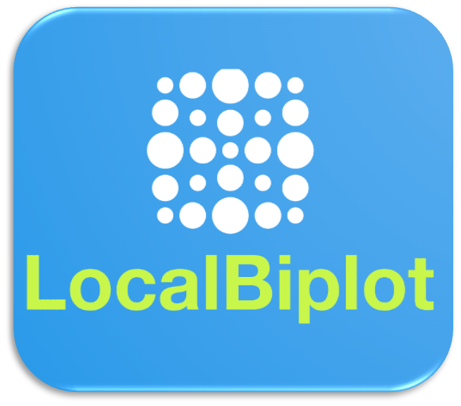

 

# UMAP-Based Local Biplot


Here, we introduce Local Biplot, a methodological framework tailored for discerning meaningful data patterns in non-stationary contexts for precision agriculture. Local Biplot relies on the well-known uniform manifold approximation and projection method, such as UMAP, and local affine transformations to codify non-stationary and non-linear data patterns while maintaining interpretability. This lets us find important clusters for transformation and projection within a single global axis pair. Hence, our framework encompasses variable and observational contributions within individual clusters. At the same time, we provide a relevance analysis strategy to help explain why those clusters exist, facilitating the understanding of data dynamics while favoring interpretability.

Please, if you use this code, cite this paper: [Crop Water Status Analysis from Complex Agricultural Data Using UMAP-Based Local Biplot](https://www.mdpi.com/2072-4292/16/15/2854)]


### Requeriments


localbiplot requires Python >= 3.8 and internet access to download the libraries

2.1 Install from source code


```python
!pip install -U git+https://github.com/Jectrianama/python-gcpds.localbiplot.git --quiet

```

2.2 Add the library in your code as follows:


```python
import gcpds.localbiplot as lb
```


